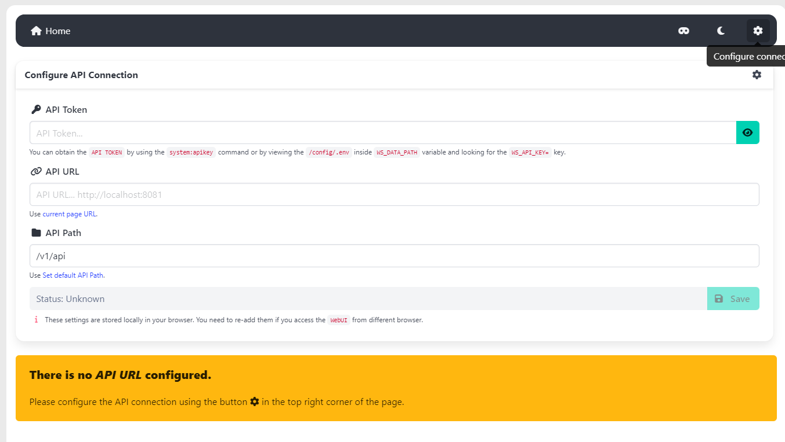
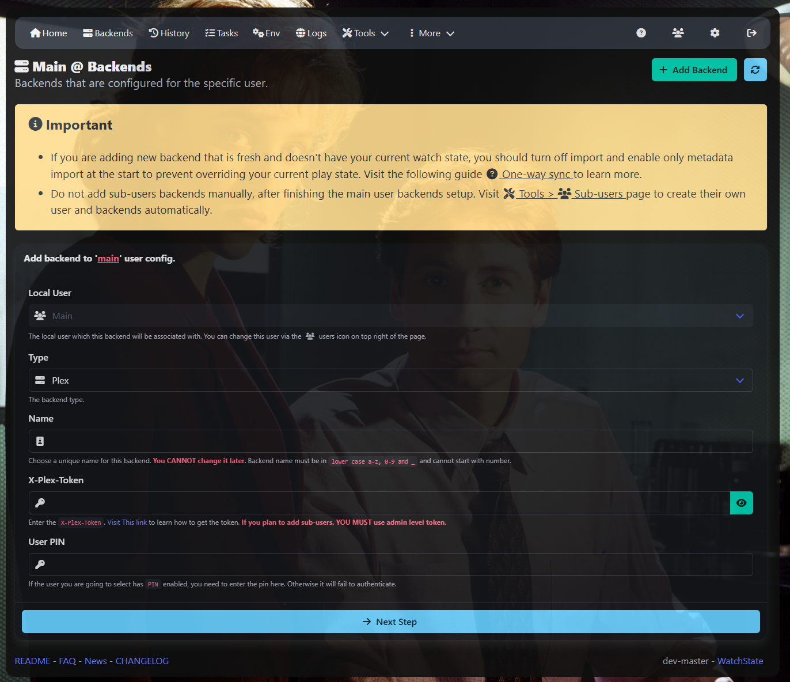

# WatchState


This tool primary goal is to sync your backends play state without relying on third party services,
out of the box, this tool support `Jellyfin`, `Plex` and `Emby` media servers.

## Updates

### 2025-02-19

We have introduced new experimental feature to allow syncing watch progress for played items. This feature is still in
early stages, and might not work as expected. and there are probably still many bugs that we need to fix. Please report
any issues you might face.

The feature is disabled by default, to enable it you need to run add this environment variable `WS_PROGRESS_THRESHOLD`
with seconds as value, the minimum value is `180` seconds. `0` seconds means it's disabled. We think reasonable value is
`86400` or more this number is about 1day.

We are still not keen on this feature, and it might be removed in future releases if we aren't able to deal with the
issues we are facing.

### 2025-02-11

We recently have added support to generate accesstoken for external `Plex` users, i.e. `not home users`. so the
`backends:create` command now supports generating the needed config files for external users. Beware the support for
this is still in early stages, and might not work as expected. report any issues you might face.

### 2025-02-05

We have added initial support to browse the WebUI as sub user, it's still in early stages, only few Endpoints support
it.
We have also added support to webhooks to allow sub users, you simply have to add new hooks using `user@backend`. Please
take look at [this FAQ](FAQ.md#how-to-add-webhooks) to learn how to use it for sub users.

--- 
Refer to [NEWS](NEWS.md) for old updates.

# Features

* WebUI.
* Sync backends play state (from many to many).
* Backup your backends play state into `portable` format.
* Receive Webhook events from media backends.
* Find `un-matched` or `mis-matched` items.
* Search your backend for `title` or `item id`.
* Display and filter your play state. Can be exported as `yaml` or `json`.
* Check if your media servers reporting same data via the parity command.
* Sync your watch progress via webhooks or scheduled tasks.
* Check if your media backends have stale references to old files.

----

# Install

create your `compose.yaml` with the following content:

```yaml
services:
    watchstate:
        image: ghcr.io/arabcoders/watchstate:latest
        # To change the user/group id associated with the tool change the following line.
        user: "${UID:-1000}:${GID:-1000}"
        container_name: watchstate
        restart: unless-stopped
        ports:
            - "8080:8080" # The port which will serve WebUI + API + Webhooks
        volumes:
            - ./data:/config:rw # mount current directory to container /config directory.
```

Create directory called `data` next to the `compose.yaml` file. After creating your docker compose file, start
the container.

```bash
$ mkdir -p ./data && docker-compose pull && docker-compose up -d
```

> [!IMPORTANT]
> It's really important to match the `user:` to the owner of the `data` directory, the container is rootless, as such
> it will crash if it's unable to write to the data directory. It's really not recommended to run containers as root,
> but if you fail to run the container you can try setting the `user: "0:0"` if that works it means you have permissions
> issues. refer to [FAQ](FAQ.md) to troubleshoot the problem.

> [!NOTE]
> For `Unraid` users You can install the `Community Applications` plugin, and search for `watchstate` it comes
> preconfigured. Otherwise, to manually install it, you need to add value to the `Extra Parameters` section in advanced
> tab/view. add the following value `--user 99:100`. This has to happen before you start the container, otherwise it
> will
> have the old user id, and you then have to run the following command from
> terminal `chown -R 99:100 /mnt/user/appdata/watchstate`.

> [!NOTE]
> To use this container with `podman` set `compose.yaml` `user` to `0:0`. it will appear to be working as root
> inside the container, but it will be mapped to the user in which the command was run under.

# Management via WebUI

After starting the container, you can access the WebUI by visiting `http://localhost:8080` in your browser.

At the start you won't see anything as the `WebUI` is decoupled from the WatchState and need to be configured to be able
to access the API.
In the top right corner, you will see a cogwheel icon, click on it and then Configure the connection settings.



As shown in the screenshot, to get your `API Token`, run the following command

```bash
$ docker exec -ti watchstate console system:apikey 
```

Copy the random string in dark yellow, into the `API Token` field Make sure to set the `API URL` or click
the `current page URL` link. If everything is set, then the Status field will turn
green. and `Status: OK` will be shown, and the reset of the navbar will show up. Which hopefully means everything is ok.

To add a backend, click on the `Backends` link in the navbar, then `+` button. as showing in the following screenshot



Fill the required information, if you get a green notification, then the backend is added successfully. If you get a
red/yellow notification, Then most likely incorrect information was provided.
You can check the message in the notification itself to know what went wrong. Or check the logs page, Most likely an
error has been logged to a file named `app.YYYYMMDD.log`.

If everything went ok, you should see the backend shows up in the same page. You can then go to the Tasks page and click
on `Queue Task`, for first time import we recommend letting
the task run in the background, as it might take a while to import all the data.

Once you have done all for your backends, You should go back again to `Tasks` page and enable the `Import` and `Export`
tasks. This will make sure your data is always in sync.
To enable/disable the task, simply click on the slider next to the task name if it's green then it's enabled, if it's
gray then it's disabled.

Once that is done, you can let the tool do its job, and you can start using the tool to track your play state.

# Management via CLI.

# Adding backend

After starting the container you should start adding your backends and to do so run the following command:

> [!NOTE]
> to get your plex token, please
> visit [this plex page](https://support.plex.tv/articles/204059436-finding-an-authentication-token-x-plex-token/) to
> know how to extract your plex token. For jellyfin & emby. Go to Dashboard > Advanced > API keys > then create new API
> keys.

```bash
$ docker exec -ti watchstate console config:add
```

This command is interactive and will ask you for some questions to add your backend.

# Managing backend

To edit backend settings run

```bash
$ docker exec -ti watchstate console config:manage -s backend_name
```

# Importing play state.

What does `Import` or what does the command `state:import` means in context of watchstate?

Import means, pulling data from the backends into the database while attempting to normalize the state.

To import your current play state from backends that have import enabled, run the following command:

```bash
$ docker exec -ti watchstate console state:import -v
```

This command will pull your play state from all your backends. To import from specific backends use
the `[-s, --select-backend]` flag. For example,

```bash
$ docker exec -ti watchstate console state:import -v -s home_plex -s home_jellyfin 
```

> [!NOTE]
> Now that you have imported your current play state enable the import task by using the following command

```bash
$ docker exec -ti watchstate console system:env -k WS_CRON_IMPORT -e true
```

### Supported import methods

Out of the box, we support the following import methods:

* Scheduled Tasks. `Cron jobs that pull data from backends on a schedule.`
* On demand. `Pull data from backends on demand. By running the state:import command manually`
* Webhooks. `Receive events from backends and update the database accordingly.`

> [!NOTE]
> Even if all your backends support webhooks, you should keep import task enabled. This help keep healthy relationship.
> and pick up any missed events.

---

# Exporting play state

What does `export` or what does the command `state:export` means in context of watchstate?

Export means, sending data back to backends, while trying to minimize the network traffic. To export your current play
state to backends that have export enabled, run the following command:

```bash
$ docker exec -ti watchstate console state:export -v
```

This command will export your current play state to all of your export enabled backends. To export to
specific backends use the `[-s, --select-backend]`flag. For example,

```bash
$ docker exec -ti watchstate console state:export -v -s home_plex -s home_jellyfin 
```

> [!NOTE]
> Now that you have exported your current play state, enable the export task by using the following command

```bash
$ docker exec -ti watchstate console system:env -k WS_CRON_EXPORT -e true
```

---

# FAQ

Take look at this [frequently asked questions](FAQ.md) page. to know more about this tool and how to enable webhook
support and answers to many questions.

---

# Social channels

If you have short or quick questions, or just want to chat with other users, feel free to join
my [discord server](https://discord.gg/haUXHJyj6Y).
keep in mind it's solo project, as such it might take me a bit of time to reply to questions.

---

# Donate

If you feel like donating and appreciate my work, you can do so by donating to children charity. For
example [Make-A-Wish](https://worldwish.org).
I Personally don't need the money, but I do appreciate the gesture.
